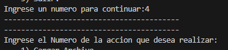
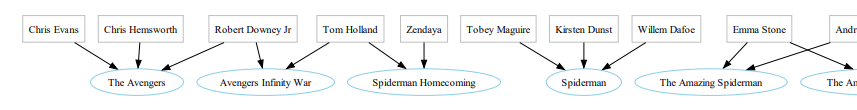

# Manual de Usuario de la practica 1

## Introducción
Se requiere el desarrollo de una aplicación que permita la lectura de un archivo de 
texto plano que contiene diferentes listas de valores separados por punto y coma. 
Estos valores contienen información como nombre de una película, actores que 
participan en ella, año de estreno y género de esta. Lo que se solicita realizar con la 
información contenida en cada línea de texto es el ordenamiento de información 
para una mejor forma de lectura y comprensión, por ello, se solicita a los estudiantes 
de Lenguajes Formales y de Programación, la implementación de un software de 
tipo consola, que permita presentar de una forma más simple la información 
relacionada con los datos brindados.

## Requisitos del Sistema
- Visual code
- Sistema Operativo: Compatible con Pytho
- Python 3.12.2  o superior
- Graphviz
- Navegador Web: Google Chrome, Mozilla Firefox, Safari

## Inicio al programa
Para poder dar inicio a nuestro programa necesitamos ejecutar el archivo
app.py que esta dentro de la carpetar LFP_P_202100692, podemos hacer usando el editor de Visual Code y dandole a ejecutar

## Inicio al programa
La primera ventana nos brinda los datos del creador como lo es el curso
seccion, numero de carnet, nombre del alumno, el programa se queda aqui hasta presionar una tecla

## Funciones del programa
En esta esta hay defierentes funciones, pero la principal es cargar archivo, para indicar que opcion deseamos tenemos que ingresar el numero correspondiente a su funcion

### Opcion 1
Aqui necesitamos copiar la ruta del archivo CSV para cargar las peliculas, actores, años y genereso

### Opcion 2
Aqui tenemos 3 funciones, 1. ver las peliculas, 2. ver los actores, 3. salir

1. ver las peliculas

2. ver los actores

2. salir, nos regresa al menu

### Opcion 3
Funcion para buscar por filtro,1. Filtrado por actor. 2.Filtrado por año.
3. Filtrado por género 4. Salir.

1) Filtrado por actor.

2) Filtrado por año.

3) Filtrado por género

4) Salir.

### Opcion 4
hacer la grafica

### Opcion 5
cierra el programa