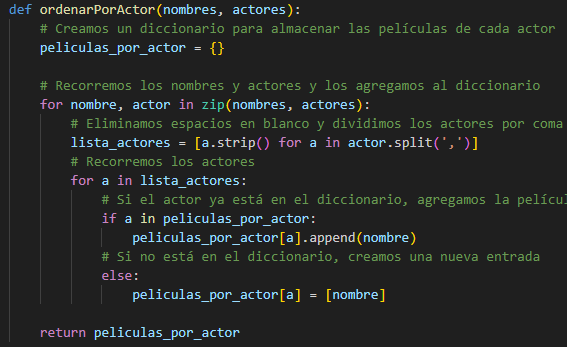

# Manual Tecnico de la practica 1

## Introduccion 

El programa ha sido desarrollado en Python y ofrece diversas opciones para visualizar la información contenida en los archivos .lfp. Además, se ha integrado el uso de Graphviz para generar diagramas que ilustran gráficamente las relaciones entre los datos proporcionados en dichos archivos.

La estructura de los archivos .lfp sigue un formato específico que facilita su manipulación dentro del programa. A continuación, se detalla la forma de esta estructura:

Cada archivo .lfp contiene datos organizados en secciones.
Cada sección comienza con un encabezado que indica el tipo de datos que contiene.
Los datos dentro de cada sección están formateados de manera coherente para su fácil lectura y procesamiento.
El programa puede leer y procesar múltiples archivos .lfp para ofrecer una visión completa de la información contenida en ellos.
Con esta estructura en mente, el programa es capaz de extraer y manipular la información de manera eficiente, permitiendo al usuario explorar y comprender los datos de manera efectiva. Además, la integración de Graphviz proporciona una herramienta visual poderosa para analizar las relaciones entre los datos y obtener una comprensión más profunda de la información presentada.

## Clase princpial 
dentro de la clase app.py es el unico constructor que hay en el proyecto

## Primera pantala
en esta funicon desplegamos la informacion solicitada del curso

## Menu de selecion 
Esta es la clase encargada de escoguer y desplegar las opciones

## Opcion 1
Encargada de cargar el archivo y regresa al menu principal

## Opcion 2
Nos permite ver las pelicualas disponible y los actores

## Opcion 3
Nos permite hacer busquedas mas espeficica de las peliculas

## Opcion 4
Genere el grafo

## Opcion 5
Cierra el programa

## Funciones dentro de leer CSV
Funcion para abrir el archivo CSV

## Funciones dentro de leer CSV
Funcion para guardar los datos del archivo

## Funciones dentro de leer CSV
Funcion que nos permite ver los actores que existen

## Funciones dentro de leer CSV
Funcion para buscar los nombres de las peliculas 

## Funciones dentro de leer CSV
Funciones de busqueda por año, actor y genereo 

## Funciones dentro de leer CSV
Funcion de hacer el grafico
